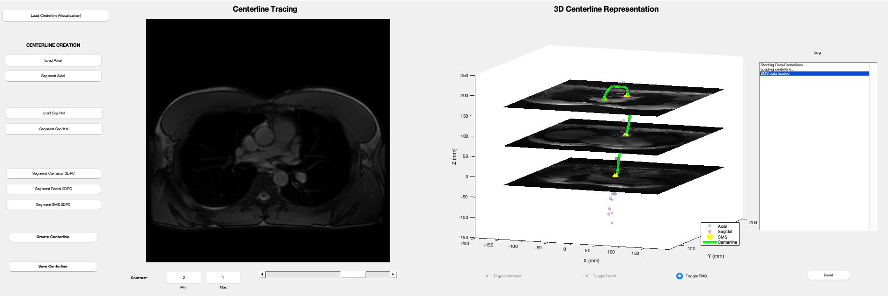
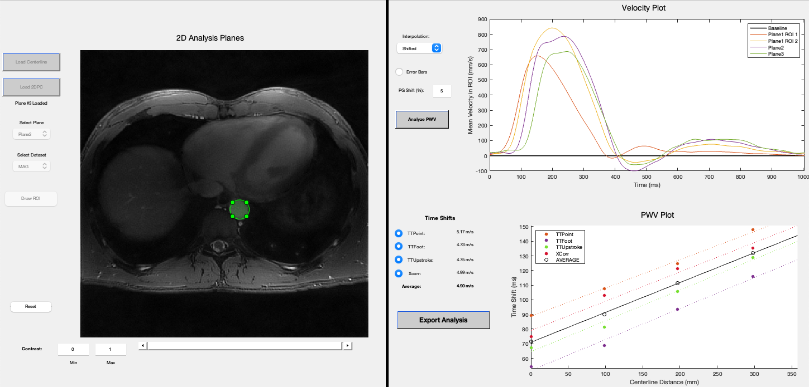

# PWV_2DPC

A MATLAB-based GUI for processing 2D phase contrast MRI scans to calculate aortic Pulse Wave Velocity (PWV). Featured in these publications:

>Breidenbach, B.M., Brach, T.L., Glittenberg, M.P., Paulsen, A.J., Symanski, L.E., Naren, T., Driscoll, I., Lose, S.R., Gallagher, C.L., Johnson, S.C., Asthana, S., Betthauser, T.J., Rivera-Rivera, L.A., Hermann, B.P., Sager, M.A., Blennow, K., Zetterberg, H., Carlsson, C.M., Kollmorgen, G., Quijano-Rubio, C., Cook, D.B., Wieben, O., Okonkwo, O.C. (2024) Cardiorespiratory Fitness Modifies the Association Between Cerebral Pulsatility on Amyloid Burden and Core CSF Biomarkers of Alzheimer’s Disease. Alzheimer’s & Dementia, 20: e090733. https://doi.org/10.1002/alz.090733

This repository consists of two main programs

## DrawCenterlines

This GUI takes in 3D anatomical image sequences and guides users through the tracing of the aortic centerline and exports it to a file.

## PWV_2DPC

This GUI takes in the generated anatomical centerline and 2D phase contrast images and calculates PWV according to 4 different time-shift algorithms.
The algorithms include:

* Time-to-Point (TTP)
* Time-to-Foot (TTF)
* Time-to-Upstroke (TTU)
* Cross-Correlation (XCorr)

For more details on these methods, see
> Wentland AL, Grist TM, Wieben O. Review of MRI-based measurements of pulse wave velocity: a biomarker of arterial stiffness. Cardiovasc Diagn Ther. 2014 Apr;4(2):193-206. doi: 10.3978/j.issn.2223-3652.2014.03.04. PMID: 24834415; PMCID: PMC3996237.

Please find the instruction sheet in the 'Instructions' folder for further details. Note that some of these instructions may be specific to our institution.
